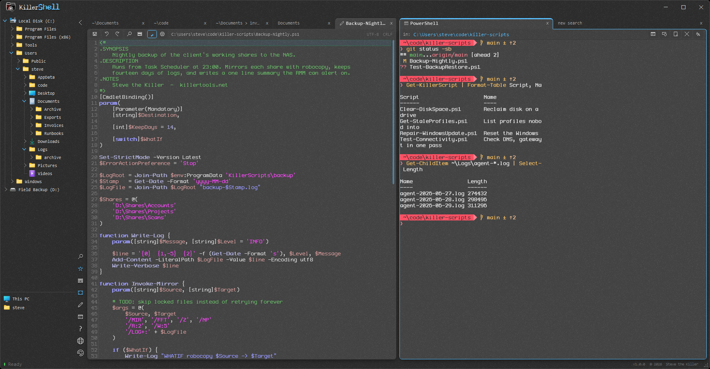
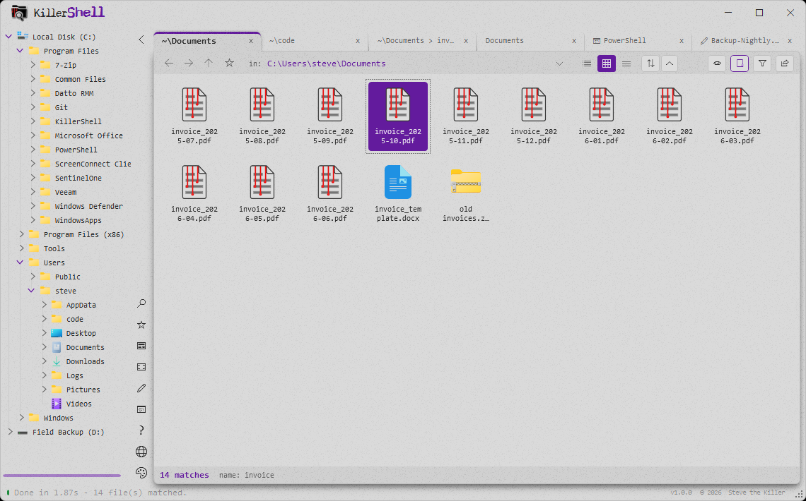
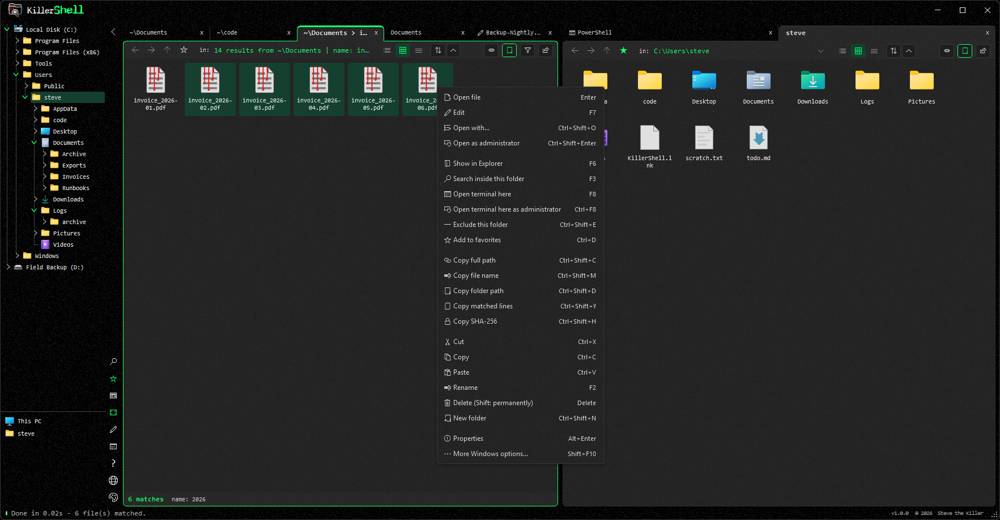
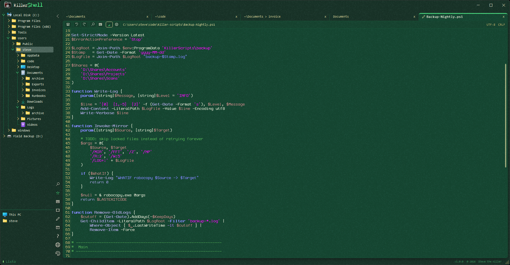

  

Free shell for power users. One window holds a file browser, a PowerShell or CMD terminal, a text editor and a full admin toolkit, on one tab strip and one set of keys, so finding a file, reading it, changing it and running something against it never means switching tools. Search is built into the browser rather than bolted on: any folder by filename wildcard or by file content, streamed live with no index to build and nothing to wait for. Processes, services, performance and the registry are one key away too.

It is one portable exe. No runtime, no agent, no account. Drop it on a machine that is not yours, do the work, delete it.
#### Open-source, GPLv3, run portable or install for just you or every user on the PC.
##### Part of [KillerTools.net](https://KillerTools.net).

## Features

### Browse

- Browse any folder in list, icon, or details view, with a folder tree, an address bar, and back / forward / up on Explorer's own keys
- Details columns resize by dragging any divider, Explorer style: the divider sizes the column on its left, the ones to its right keep their widths and slide, and a double-click puts a column back. Ctrl+wheel over the list resizes the icons in every view, not just tiles. Both are remembered
- Favorites drawer for the folders you live in, with Alt+1 to Alt+0 to jump to the first ten
- Two panes, side by side or stacked (F10), each with its own tabs
- A browsed folder tracks the disk, so a file deleted in another window disappears here too

### Terminal

- PowerShell, Windows PowerShell or CMD in a tab (F8), elevated on Ctrl+F8, opened in the folder you are looking at
- The working directory is tracked live on the shell's own toolbar; click it to open that folder as a tab
- A shipped prompt script you can edit or reset, and your PowerShell `$PROFILE` one click from the rail, the shell's right-click menu or Ctrl+comma. The submenu lists the hosts actually installed and asks each one where its profile is rather than guessing the path
- Powerline separators, the git branch mark and the prompt chevron render on a machine with no Nerd Font installed: the exe carries a 26-glyph, 2.9 KB fallback face, used only for the codepoints your chosen font is missing

### Edit

- Open any file in a tab with F7 or the Edit row on the results menu: syntax highlighting, line numbers, undo, find (Ctrl+F), go to line (Ctrl+G), save (Ctrl+S) and a right-click menu, with word wrap on by default
- The pencil on the rail opens a blank document in the pane you are looking at, for the note or throwaway script that has nowhere to live yet. Nothing touches disk until you save it, and naming it is also what gives it highlighting
- Encoding is preserved, never invented. A BOM present is kept, a BOM absent stays absent, and the document bar shows both the encoding and the line ending
- Highlighting for the formats a field tech actually opens: `.bat` / `.cmd`, `.reg`, `.ini` / `.conf` / `.cfg` / `.inf`, `.yml` / `.yaml`, `.log` and `.csv` / `.tsv`, on top of the languages AvalonEdit already knows
- Settings behind a gear: line numbers, current-line highlight, visible spaces and tabs, spaces vs tabs and indent width, plus its own font slot in the Fonts dialog and Ctrl+wheel to resize

### Search

- Filename search with wildcard patterns (`*.log`, `report_*.xlsx`, etc.)
- Content search streams through files line by line without loading them into RAM
- Multicore engine: the scan parallelizes across every CPU core
- Multiple search terms in a single pass, each independently tracked, in ANY / ALL groups
- Filters by extension, date modified, and size, plus include/exclude patterns and a case-sensitive toggle
- Search within results: pipe one search's results into a new tab and drill deeper
- Sort results by name, location, size, or modified date; Ctrl+F filters the list live *(Yo dawg, I heard you liked search...)*
- Results show matched lines with line numbers; open files directly or reveal them in Explorer
- Export to a self-contained HTML report (with its own theme switcher) or CSV

### Files

- File operations on results and folders alike: copy, cut, paste, rename, delete to the Recycle Bin or permanently, new folder
- Copy and move run off the UI thread with a real progress card, and a collision stops to ask, showing both files' size and date, with Replace, Skip or Keep both
- Two-way drag and drop with Explorer, following Explorer's own modifier rules: Shift moves, Ctrl copies
- Right-click anything for the full Windows shell menu, so whatever your other tools add to Explorer is still one click away
- Copy the full path, file name, folder path, matched lines, the files themselves or a SHA-256, all from one menu

### Admin tools

- Processes/Services (F9, elevated on Ctrl+F9): a live grid of CPU, memory and owner per process, filterable by name, path or user; end or restart a process, or start, stop and restart a service, each behind a confirm dialog. Ctrl+period switches between the two views
- Performance Monitor (F11): a Task-Manager-style live view with one tile per CPU, RAM, disk, network adapter and GPU, a minute of history on every graph, and a per-core CPU breakdown
- Event Viewer (Ctrl+F12, always elevated): reads the Application, System and Security logs with level and text filtering, full record detail with a raw XML view, and paging through the filtered results
- Registry Editor (Ctrl+F11, always elevated): a lazy-loading tree over all five hives, type-aware editing for every value kind, create/rename/delete for keys and values, and Ctrl+F to search loaded key and value names

### Interface

- Keyboard first. Explorer's conventions where they exist (Enter opens, F2 renames, Alt+Enter for properties, Shift+F10 for the shell menu), and single keys rather than chords where they do not: F5 refresh, F6 reveal, F7 edit, F8 shell, F9 processes, F10 split, F11 performance, F12 about
- F1 opens a shortcuts card that lists every gesture as both a grouped list and a visual keyboard, with layer buttons for the Ctrl / Shift / Alt maps and a live preview when you hold a real modifier
- Tabs: each tab is an independent search, a folder, a terminal or a document; drag to reorder, optionally restored on the next launch. New tabs open in the pane you are looking at, and once they would get too narrow to read the strip keeps as many as fit and a chevron lists the rest
- Three toolbars, one per kind of tab, so a document is not carrying a folder listing's sort and view buttons
- Six killer themes with live accent colors; UI localized in 10 languages
- App-wide accessibility zoom: roll the wheel over the wordmark to resize everything between 70% and 250%
- Run portable, or install for just you or for every user on the PC (`/silent` installs machine-wide for winget/RMM)

## Screenshots

<table>
<tr>
<td width="50%"> Two panes on one tab strip - a script open in the editor on the left, a PowerShell tab on the right.</td>
<td width="50%"> Tile view with a filename search still streaming: 14 matches in 1.87s, no index. Six themes with live accent colors.</td>
</tr>
<tr>
<td> The results menu: edit, open as administrator, search inside this folder, open a terminal here, copy a SHA-256.</td>
<td> Ten languages - here Spanish, with a PowerShell script open in the editor.</td>
</tr>
</table>

## Requirements

- Windows 10 or 11 (x64)
- [.NET Framework 4.8](https://dotnet.microsoft.com/download/dotnet-framework/net48) (included in Windows 10 1903+ and Windows 11)

## Download

- Prebuilt binary: <https://github.com/SteveTheKiller/KillerShell/releases/latest/download/KillerShell.exe>
- Source (GPL3 corresponding source for this release): <https://github.com/SteveTheKiller/KillerShell/releases/download/v1.1.1/KillerShell-1.1.1-src.zip>

## Build

Open `KillerShell.sln` in Visual Studio 2022 and build. No external dependencies beyond the NuGet packages in the project file. The editor is AvalonEdit, vendored as source under `third_party/AvalonEdit` and compiled into the exe rather than shipped as a DLL, so the build still produces one portable file.

`release.ps1` additionally produces a versioned `KillerShell-<version>-src.zip` next to the published EXE, which is the GPL3 corresponding source published with every release.

## License

GPL-3.0 - see [LICENSE](LICENSE).

Two components carry their own licenses and keep them:

- AvalonEdit, the editor - MIT. See [third_party/AvalonEdit/LICENSE](third_party/AvalonEdit/LICENSE).
- `Fonts/KillerGlyphs.ttf`, a 26-glyph subset of Terminess Nerd Font - SIL OFL 1.1. See [Fonts/KillerGlyphs-NOTICE.txt](Fonts/KillerGlyphs-NOTICE.txt) and [Fonts/KillerGlyphs-OFL.txt](Fonts/KillerGlyphs-OFL.txt).
