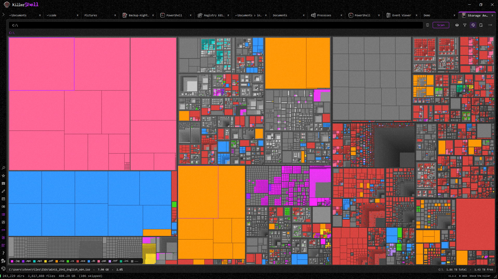
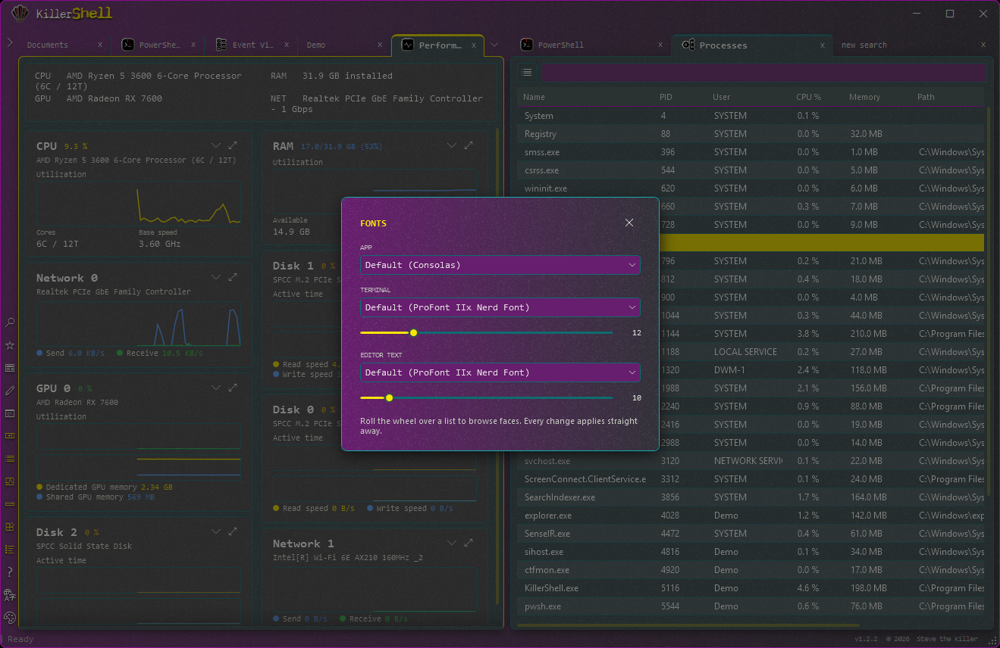
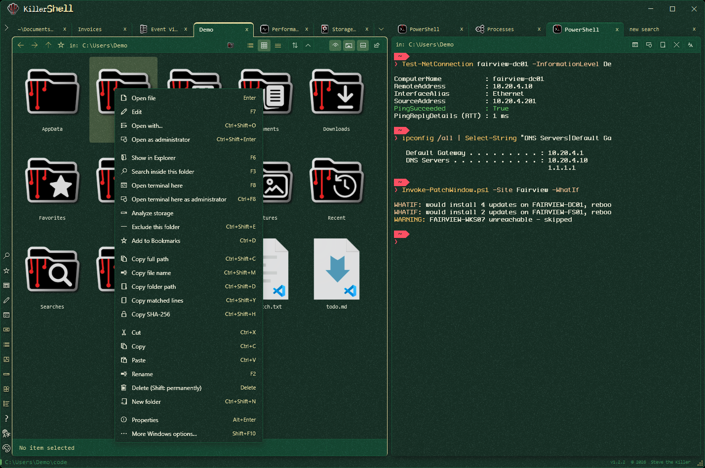
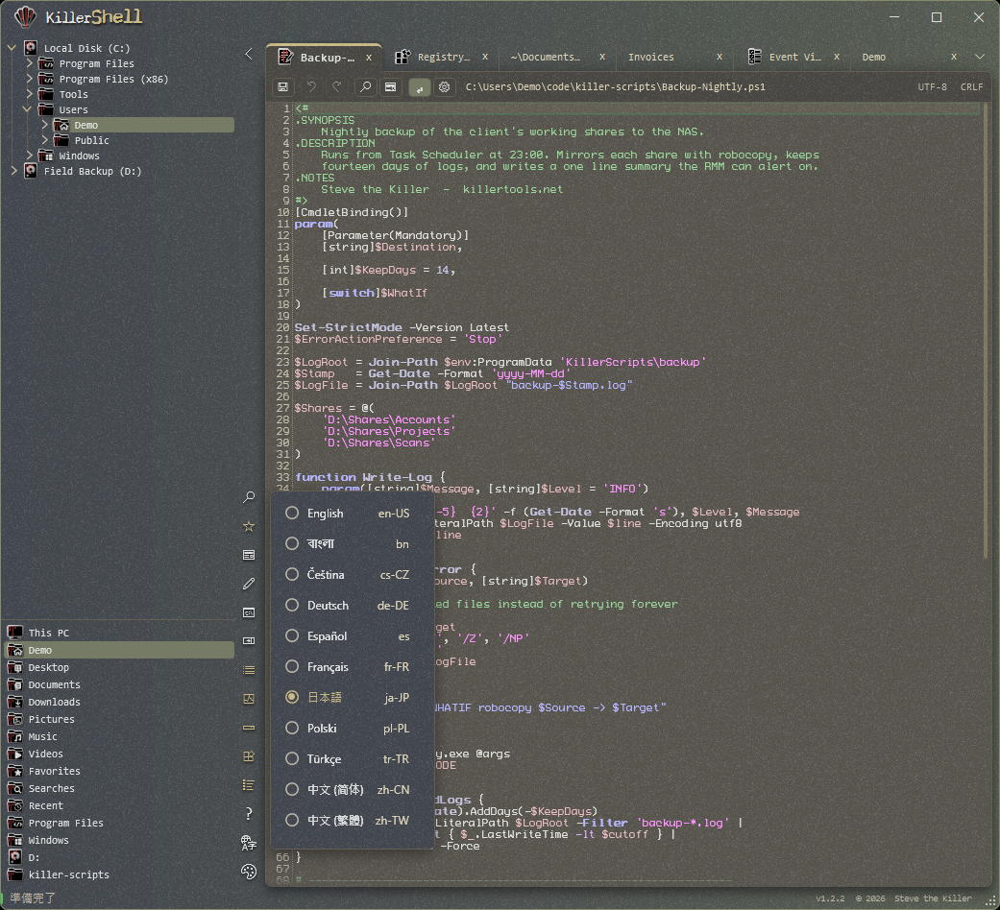

<p align="center">
  <a href="https://killershell.net"></a>
</p>

Free and open-source Windows shell for power users. A file browser, PowerShell or CMD terminal, text editor, search engine, and administration toolkit share one window, one tab strip, and one set of keys.

KillerShell is one portable EXE with no agent, account, telemetry, or separate runtime installer. Run it from anywhere, install it for your account, or install it machine-wide for every user.

Full how-tos live on the [help page](https://killershell.net/help.html); architecture, formats, security decisions, and implementation details are on the [technical page](https://killershell.net/technical.html).

## Features

- Browse folders in list, icon, or details view with tabs, favorites, a folder tree, live filesystem updates, and two panes arranged side by side or stacked
- Search names with wildcards or stream file contents line by line across every CPU core, with multiple ANY/ALL terms, filters, chained searches, and HTML or CSV export
- Open PowerShell, Windows PowerShell, or CMD in the current folder; track its working directory live and edit the included prompt or your real PowerShell profile
- Edit text with syntax highlighting, find, go to line, undo/redo, encoding and line-ending preservation, indentation controls, and a dedicated font setting
- Copy, move, rename, recycle, permanently delete, and drag files to or from Explorer, with asynchronous progress and Replace, Skip, or Keep both collision handling
- Work with ZIP archives, including empty folders and complete folder-tree drag-out, without changing the original when a rewrite is canceled
- Inspect and manage processes and services, including live CPU and memory sorting, filtering, ownership, restart, and elevation where needed
- Monitor CPU, RAM, disks, networks, and GPUs with live graphs and per-core CPU history
- Use the built-in Event Viewer, Registry Editor, and Storage Analyzer without leaving the tab strip
- Keyboard-first operation using familiar Explorer keys plus F4 storage, F7 edit, F8 shell, F9 processes, F10 split, F11 performance, and F1 for the complete shortcut overlay
- Thirteen themes, including a full 98SE recreation; Dark, Light, Black, and 98SE each have six accent colors for 33 looks in all
- Localized in 12 languages, with live switching and English fallback for incomplete translations
- Runs portable or self-installs per-user without UAC or machine-wide with UAC; `/silent` supports WinGet and managed deployment
- Local-only: no indexing service, cloud account, advertisements, or telemetry

## Screenshots

<table>
<tr>
<td width="50%"><br><sub>Storage Analyzer turns a drive into a color-coded treemap with filtering, zoom, export, and file operations built in.</sub></td>
<td width="50%"><br><sub>Performance graphs and the searchable process manager stay live while app, terminal, and editor fonts are adjusted.</sub></td>
</tr>
<tr>
<td><br><sub>Browse files beside a live PowerShell tab; search, terminals, storage analysis, hashing, and admin actions stay one click away.</sub></td>
<td><br><sub>Syntax-highlighted editing, a persistent folder tree, and live switching among eleven localized interfaces.</sub></td>
</tr>
</table>

## Requirements

- Windows 10 or 11 (x64)
- .NET Framework 4.8, included with every supported Windows release

## Download

WinGet:

```powershell
winget install SteveTheKiller.KillerShell
```

- Prebuilt binary: <https://github.com/SteveTheKiller/KillerShell/releases/latest/download/KillerShell.exe>
- Source (GPL3 corresponding source for this release): <https://github.com/SteveTheKiller/KillerShell/releases/download/v1.2.2/KillerShell-1.2.2-src.zip>

## Build from source

Open `KillerShell.sln` in Visual Studio 2022 and build, or run:

```powershell
dotnet publish KillerShell.csproj -c Release
```

The app targets .NET Framework 4.8. AvalonEdit is vendored under `third_party/AvalonEdit` and compiled directly into KillerShell, so the published app remains one portable executable. `release.ps1` also produces the versioned GPL3 source archive shipped with each release.

## Translations

UI strings live in `Strings/`, one XAML `ResourceDictionary` per locale. To add or improve a language, see [TRANSLATING.md](TRANSLATING.md). Missing keys fall back to English, so a partial translation is welcome.

## Changelog

See [CHANGELOG.md](CHANGELOG.md).

## License

GPLv3. See [LICENSE](LICENSE). If you fork, modify, or redistribute KillerShell, your version must also be released under GPLv3 with source available.

Bundled components retain their own licenses:

- AvalonEdit - MIT ([license](third_party/AvalonEdit/LICENSE))
- `Fonts/KillerGlyphs.ttf`, a Terminess Nerd Font subset - SIL OFL 1.1 ([notice](Fonts/KillerGlyphs-NOTICE.txt), [license](Fonts/KillerGlyphs-OFL.txt))
- 98SE icons from [Chicago95](https://github.com/grassmunk/Chicago95) - GPL-3.0+/MIT ([attribution](Resources/icons/98/ATTRIBUTION.md))
